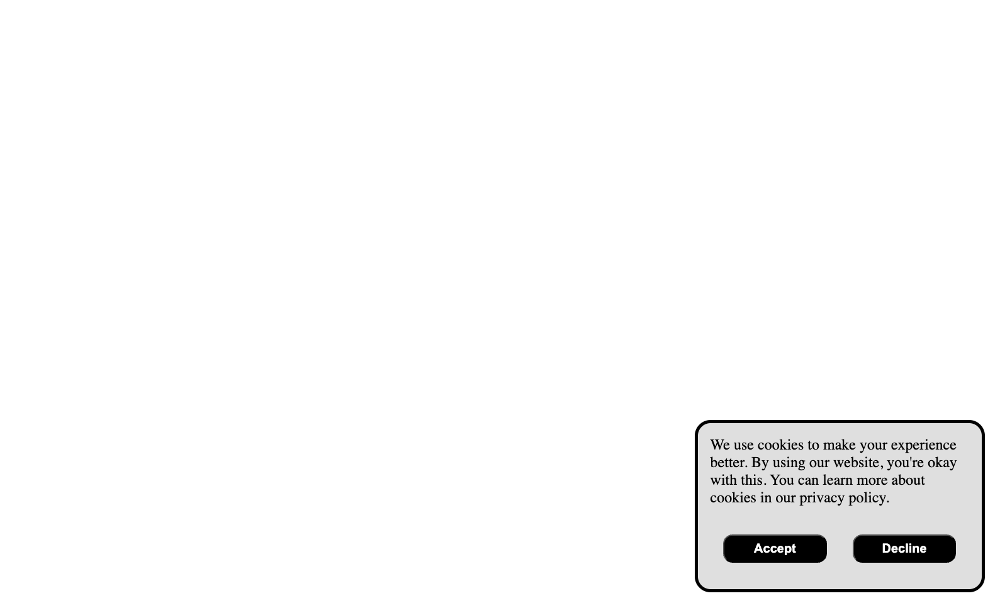

# Cookie Consent

[✅ Back to Web Roadmap Projects ✅](https://github.com/YounesMoukhlij/web-roadmap-projects)

This project is designed to introduce you to basic DOM manipulation and event handling in JavaScript.

Many websites display a cookie consent popup to inform users about the use of cookies and to obtain their consent. In this project, you will create a simple cookie consent popup that appears when the user visits the page. The popup will include a message and a button to accept the consent. Once accepted, the popup will disappear.

## Project Overview

Here's an example of how the cookie consent popup should look:

The popup includes:
- A clear message about cookie usage
- Accept and Decline buttons
- Clean, modern styling
- Proper positioning on the page

Bonus points if you persist the user's consent using cookies or local storage and prevent the popup from appearing on subsequent visits.

## Project Source

This project is based on the roadmap.sh project: [Cookie Consent](https://roadmap.sh/projects/cookie-consent)
